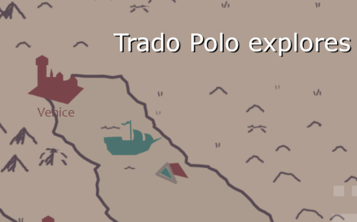

# Trado Polo explores

An entry for the [js13kgames](https://js13kgames.com/) [2023](http://2023.js13kgames.com/) gamejam for the theme "13th Century".

Entry: https://js13kgames.com/entries/trado-polo-explores

Tag for the jam version: [js13k2022-submission](https://github.com/gheja/js13k2023/releases/tag/js13k2023-submission)

The main branch contains some further developments.

# Details

The game is loosely based on Marco Polo's exploration and trades during the 13th century.

The game is created with HTML5 + TypeScript + CSS, GIMP for graphics, the colors are based on the [Lost Century Palette](https://lospec.com/palette-list/lost-century) by [CopheeMoth](https://lospec.com/copheemoth).
